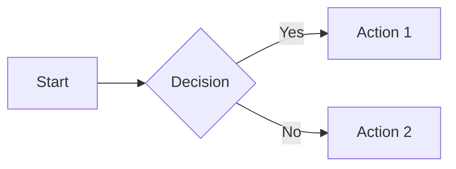

# Тест подсветки синтаксиса (highlight.js)

Файл для проверки issue #14. Открыть через F3 в Total Commander с установленным плагином.

## 1. Стандартные языки (должны подсвечиваться)

### JavaScript
```javascript
function greet(name) {
  const greeting = `Hello, ${name}!`;
  console.log(greeting);
  return greeting.length;
}
```

### Python
```python
def fibonacci(n):
    if n <= 1:
        return n
    a, b = 0, 1
    for _ in range(n - 1):
        a, b = b, a + b
    return b

print([fibonacci(i) for i in range(10)])
```

### C#
```csharp
public class Greeter
{
    private readonly string _name;
    public Greeter(string name) => _name = name;
    public string Greet() => $"Hello, {_name}!";
}
```

### JSON
```json
{
  "name": "test",
  "version": "1.0.0",
  "dependencies": {
    "highlight.js": "^11.0.0"
  }
}
```

### Bash
```bash
#!/bin/bash
for file in *.md; do
  echo "Processing: $file"
  wc -l "$file"
done
```

## 2. Языки с особыми символами (alias-handling)

### C++ (нативный hljs alias `c++`)
```c++
#include <iostream>
template<typename T>
class Container {
public:
    void add(const T& item) { items.push_back(item); }
private:
    std::vector<T> items;
};
```

### C# через `c#` (требует aliasMap → csharp)
```c#
using System;
var nums = new[] { 1, 2, 3 };
Console.WriteLine(nums.Sum());
```

### F# через `f#` (требует aliasMap → fsharp)
```f#
let factorial n =
    let rec loop acc n =
        if n <= 1 then acc
        else loop (acc * n) (n - 1)
    loop 1 n

printfn "%d" (factorial 10)
```

## 3. Edge cases (НЕ должны подсвечиваться)

### Classless блок (без языка)
```
This text has no language hint.
Should remain plain, not auto-detected.
```

### Несуществующий язык
```esperanto
mi amas vin
```
Должен остаться без подсветки, без warning в console.

## 4. Mermaid (не должен трогаться highlight.js)



## 5. Inline code (highlight.js его не трогает)

Текст с `inline code` и `var x = 1;` — должен остаться обычным моноширинным.

## Что проверять

1. **Светлая тема** (`CustomCSS=css\github.css` в ini) — все блоки выше подсвечиваются в `github`-теме hljs.
2. **Тёмная тема** (`CustomCSSDark=css\github.dark.css`, либо TC dark mode) — те же блоки в `github-dark`-теме.
3. **Mermaid** — flowchart рендерится как диаграмма, не как код.
4. **Без интернета** — блоки видны без подсветки, страница не падает.
5. **`EnableSyntaxHighlight=0`** в `Build/MarkdownView.ini`, рестарт TC — подсветки нет, в HTML нет `<script src=".../highlight.js">`.
6. **Cache invalidation** — переключить `EnableSyntaxHighlight=0↔1`, рестарт TC, переоткрыть тот же файл → перерендер с/без подсветки.
