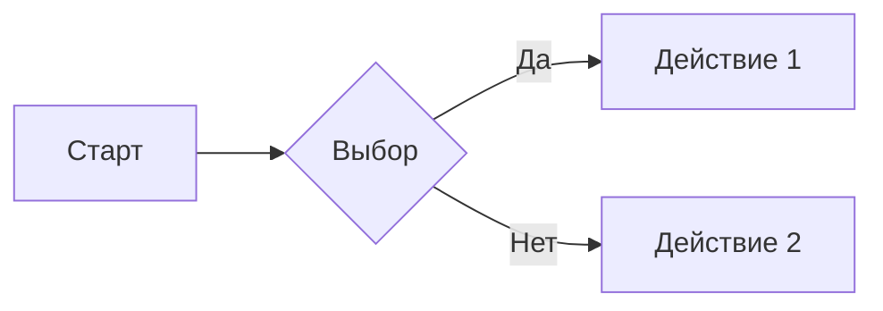

# Проверка подсветки синтаксиса

После открытия этого файла в Lister первая половина должна показать цветной код с разной окраской ключевых слов, строк и комментариев. Вторая половина — наоборот, должна остаться обычным одноцветным текстом. Если в одном из этих мест поведение перепутано — подсветка работает не так, как задумано.

## Чек-лист

- [ ] Первая половина: каждый блок раскрашен в стиле GitHub
- [ ] Вторая половина: ни один блок не раскрашен
- [ ] Диаграмма (предпоследний раздел) рисуется как картинка, а не как текст
- [ ] При переключении Total Commander в тёмную тему цвета подсветки тоже становятся тёмными

---

# Должно подсветиться

## JavaScript

```javascript
function greet(name) {
  const greeting = `Hello, ${name}!`;
  console.log(greeting);
  return greeting.length;
}
```

## Python

```python
def fibonacci(n):
    if n <= 1:
        return n
    a, b = 0, 1
    for _ in range(n - 1):
        a, b = b, a + b
    return b
```

## C#

```csharp
public class Greeter
{
    private readonly string _name;
    public Greeter(string name) => _name = name;
    public string Greet() => $"Hello, {_name}!";
}
```

## JSON

```json
{
  "name": "test",
  "version": "1.0.0",
  "dependencies": {
    "highlight.js": "^11.0.0"
  }
}
```

## Bash

```bash
#!/bin/bash
for file in *.md; do
  echo "Обработка: $file"
  wc -l "$file"
done
```

## C++ — название с плюсами

```c++
#include <iostream>
template<typename T>
class Container {
public:
    void add(const T& item) { items.push_back(item); }
private:
    std::vector<T> items;
};
```

## C# — название с решёткой

```c#
using System;
var nums = new[] { 1, 2, 3 };
Console.WriteLine(nums.Sum());
```

## F# — название с решёткой

```f#
let factorial n =
    let rec loop acc n =
        if n <= 1 then acc
        else loop (acc * n) (n - 1)
    loop 1 n
```

---

# Не должно подсветиться

## Блок без указания языка

```
Это обычный текст без указания языка.
Он должен остаться одного цвета — как абзац в книге.
```

## Несуществующий язык

```esperanto
mi amas vin
```

В таблице языков плагина «esperanto» нет, поэтому блок остаётся обычным.

## Текст внутри строки

В этом абзаце есть `var x = 1;` и `function()`. Они должны выглядеть как обычный моноширинный шрифт без раскраски — потому что подсветка применяется только к блокам кода, а не к коротким вставкам внутри текста.

---

# Диаграмма Mermaid

Этот блок не код, а схема. Подсветка не должна его трогать — он должен превратиться в картинку с прямоугольниками и стрелками.



---

# Если что-то не так

| Что видно | Что проверить |
|---|---|
| Ни один блок не подсвечен | Открыть `MarkdownView.ini`, в разделе `[Renderer]` параметр `EnableSyntaxHighlight=1`. После правки — перезапустить Total Commander. |
| Подсветился только текст с указанным языком, а C++/C#/F# — нет | Версия плагина старая. Нужна свежая сборка `MarkdownView.wlx64`. |
| Подсветка появляется и в блоках без языка | Нарушено разделение на «должно» и «не должно». Сообщить, какой именно блок. |
| Диаграмма Mermaid стала цветным кодом вместо схемы | Подсветка перехватила её зря. Сообщить с пометкой «mermaid». |
| Блоки видны, но без цвета, и в правом нижнем углу значок «нет соединения» | Нет интернета — библиотека подсветки загружается через сеть. На локальную работу плагина это не влияет, текст читать по-прежнему можно. |
